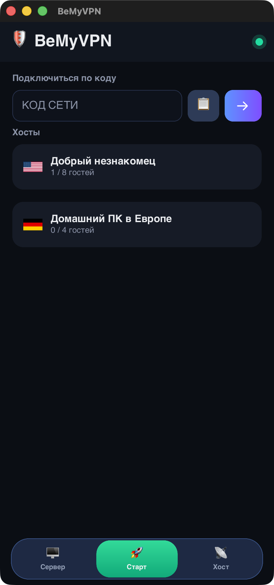
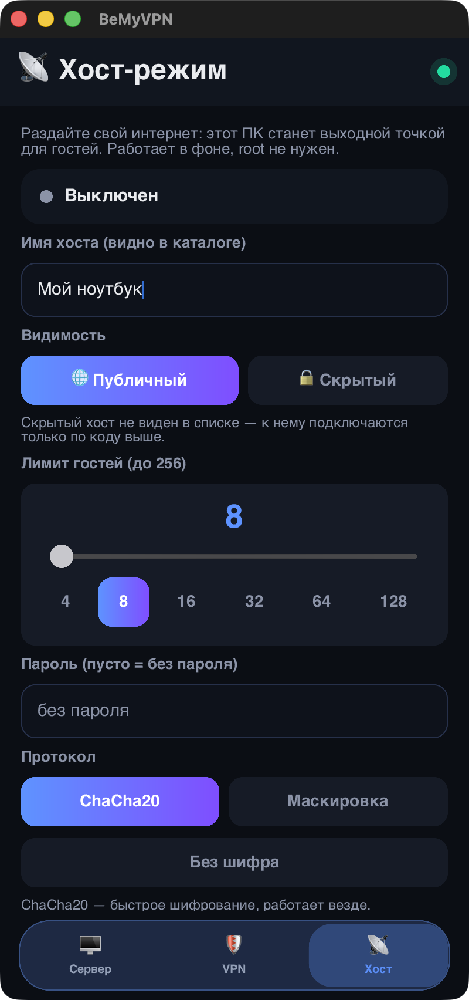
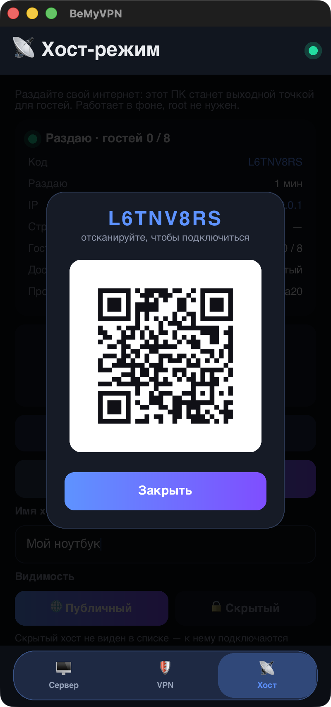

# 🌍 BeMyVPN — «Будь моим VPN»

**Свободный интернет через живого человека.** Кто угодно — друг, родственник или
просто добрый незнакомец из списка — нажимает одну кнопку и делится своим
интернетом. Ты нажимаешь одну кнопку — и выходишь в сеть через него. Без аренды
серверов, без регистраций, без оплаты.

> 💡 **Зачем это?** Чтобы помочь попасть туда, где есть свобода слова и доступ
> к информации. Обычный VPN по классу ПО — целиком в рамках закона.

<p align="center">
  
  
  
</p>

---

## 🤔 Как это работает (объясняем просто)

- 📡 **Хост** — тот, кто **делится** интернетом. Нажал «Стать хостом» — всё.
- 🛡 **Гость** — тот, кто **подключается**. Выбрал хоста из списка (или ввёл код) —
  и весь интернет идёт через него по шифрованному туннелю.
- 🗂 **Сервер-координатор** — «доска объявлений»: показывает, кто сейчас раздаёт,
  и знакомит вас. **Ваш трафик через него не проходит ВООБЩЕ** — даже в
  зашифрованном виде: туннель строится напрямую между вами, координатор его
  физически не видит.

```
      📡 ХОСТ  ←═══ шифрованный туннель НАПРЯМУЮ ═══→  🛡 ГОСТЬ
          ↖                                          ↗
            «я раздаю!»               «кто раздаёт?»
                    ↘               ↙
                 🗂 СЕРВЕР-КООРДИНАТОР
        (только знакомит — трафик мимо него)
```

- 🔐 Шифрование — то же, что в WireGuard (ChaCha20-Poly1305).
- 🙅 Root/админ для **раздачи не нужен**. Хост — телефон, ноутбук или сервер.
- 📶 Раздача работает даже без «белого» IP — на **большинстве** обычных домашних
  подключений (NAT пробивается автоматически). А подключаться гостём можно вообще
  откуда угодно.

---

## 📥 Скачать

Каждый файл — **без архивов**: скачал → запустил. Ставить больше ничего не надо.

| 📱 Устройство | Скачать | Как запустить |
|---|---|---|
| 🤖 **Android** | [`bemyvpn-android-arm64.apk`](https://github.com/mister-PARADISE/bemyvpn/releases/latest/download/bemyvpn-android-arm64.apk) | установить → открыть |
| 🍎 **macOS** (Apple Silicon) | [`bemyvpn-macos-arm64.dmg`](https://github.com/mister-PARADISE/bemyvpn/releases/latest/download/bemyvpn-macos-arm64.dmg) | открыть → перетащить в «Программы» → **первый раз: правый клик → «Открыть»**, дальше обычный двойной клик¹ |
| 🪟 **Windows** | [`bemyvpn-windows-x86_64.exe`](https://github.com/mister-PARADISE/bemyvpn/releases/latest/download/bemyvpn-windows-x86_64.exe) | двойной клик — всё внутри |
| 🐧 **Linux** | [`bemyvpn-linux-x86_64.AppImage`](https://github.com/mister-PARADISE/bemyvpn/releases/latest/download/bemyvpn-linux-x86_64.AppImage) | одна команда:<br>`chmod +x bemyvpn-linux-x86_64.AppImage && ./bemyvpn-linux-x86_64.AppImage`<br>(после `chmod` открывается и двойным кликом) |

<sub>¹ Правый клик нужен **один раз** (потом обычный двойной): так macOS относится
ко всем приложениям не из App Store. На работу это не влияет — весь функционал
доступен. (Убрать правый клик можно только платной подписью Apple — сознательно
не делаем.)</sub>

<sub>Для терминала и серверов — консольная версия, см. [ниже](#-хочу-помочь-хост-на-сервере-247). Все файлы: [Releases](https://github.com/mister-PARADISE/bemyvpn/releases).</sub>

---

## 🚀 Подключиться к VPN — 3 шага

1. 📥 Скачай и открой приложение (таблица выше).
2. 🛡 На вкладке **VPN** выбери хоста → **«Подключить»**.
   Тебе дали **код**? Введи его в поле сверху (на телефоне можно отсканировать QR).
3. ✅ Готово — весь интернет идёт через хоста. Отключиться — красная кнопка ✕ внизу.

> 🍏🐧🪟 На компьютере при *подключении* система один раз спросит пароль/разрешение —
> так любая ОС защищает создание VPN-туннеля. Для *раздачи* не нужно ничего.

## 📡 Поделиться интернетом — 2 шага

1. 📡 Вкладка **Хост** → кнопка **«Стать хостом»**.
2. 💬 Отправь свой **код сети** тому, кому хочешь помочь («Код» — копирует,
   «QR» — показывает QR, человек наведёт камеру и подключится).

Оставишь «Публичный» — тебя увидят все в списке. Переключишь на «Скрытый» —
найдут **только по коду**. Пароль и лимит гостей — по желанию, меняется на лету.

---

## 🖥 Хочу помочь: хост на сервере (24/7)

Есть VPS или сервер? Преврати его в точку выхода **одной командой** (root не нужен):

```bash
curl -LO https://github.com/mister-PARADISE/bemyvpn/releases/latest/download/bemyvpn-linux-x86_64-terminal && chmod +x bemyvpn-linux-x86_64-terminal && ./bemyvpn-linux-x86_64-terminal host --tunnel
```

Всё — ты в каталоге, к тебе могут подключаться. 🎉

<details><summary>⚙️ <b>Чтобы работал всегда (автозапуск, systemd)</b> — клик</summary>

```bash
sudo mv bemyvpn-linux-x86_64-terminal /opt/bemyvpn-host && sudo tee /etc/systemd/system/bemyvpn-host.service >/dev/null <<'UNIT'
[Unit]
Description=BeMyVPN Host
After=network-online.target
Wants=network-online.target
[Service]
ExecStart=/opt/bemyvpn-host host --tunnel
Restart=always
RestartSec=2
[Install]
WantedBy=multi-user.target
UNIT
sudo systemctl daemon-reload && sudo systemctl enable --now bemyvpn-host
```
</details>

<details><summary>🖥 <b>Полноэкранное меню в терминале</b> — клик</summary>

Запусти бинарь **без аргументов** — откроется меню с теми же тремя вкладками
(VPN / Хост / Сервер), навигация стрелками и Tab:

```bash
./bemyvpn-linux-x86_64-terminal
```
Работает и на macOS (`bemyvpn-macos-arm64-terminal`) и Windows (`bemyvpn-windows-x86_64-terminal.exe`).
</details>

---

## 🌐 Свой сервер-координатор (по желанию)

Не хочешь зависеть от `bemyvpn.net`? Подними **свой** — тем же файлом, за минуту.
HTTPS-сертификат он получит и будет продлевать **сам** (Let's Encrypt встроен).

<details><summary>🗂 <b>Инструкция</b> — клик</summary>

```bash
mkdir -p /opt/bemyvpn && cd /opt/bemyvpn
curl -LO https://github.com/mister-PARADISE/bemyvpn/releases/latest/download/bemyvpn-linux-x86_64-terminal
mv bemyvpn-linux-x86_64-terminal bemyvpn && chmod +x bemyvpn

cat > bemyvpn.toml <<'CFG'
[server]
bind       = "0.0.0.0:443"
domain     = "твой.домен"       # ← сертификат получится сам
acme_email = "you@example.com"  # (необязательно)
CFG

sudo ./bemyvpn --config bemyvpn.toml server
```

Проверка: `bemyvpn --coordinator https://твой.домен ping` → «жив ✅».
В приложениях друзей: вкладка **«Сервер»** → вписать `https://твой.домен`.

Автозапуск (кнопка в меню / systemd) и все команды — в [docs/RUNNING.md](docs/RUNNING.md).
</details>

---

## ❓ Частые вопросы

<details><summary>🧑‍⚖️ <b>Это законно?</b></summary>

Да. Это обычный VPN — тот же класс ПО, что и сотни VPN-приложений в сторах.
Разница лишь в том, что выходная точка — не арендованный сервер, а живой человек.
</details>

<details><summary>🔐 <b>Это безопасно?</b></summary>

- Туннель шифруется сквозно (Noise/ChaCha20 — как в WireGuard), ключи никуда не уходят.
- Координатор ваш трафик **не видит вообще** — он идёт напрямую между вами, мимо него.
- Гость не может залезть в домашнюю сеть хоста (LAN закрыт по умолчанию).
- «Угнать» или подделать хост в каталоге нельзя (запись привязана к секретному
  токену), а коды сетей выдаёт и подписывает только сервер.
</details>

<details><summary>📶 <b>У меня «серый» IP / я за роутером — получится?</b></summary>

- **Подключаться гостём** — получится всегда, из любой сети.
- **Раздавать хостом** — у большинства тоже получится: приложение само пробивает
  NAT (hole-punching). Не выйдет только за самыми строгими NAT — приложение
  честно скажет, если раздача из твоей сети невозможна.
</details>

<details><summary>💸 <b>Сколько стоит?</b></summary>

Нисколько. Опенсорс, без регистраций, подписок и рекламы.
</details>

<details><summary>🔑 <b>Нужен ли root / права администратора?</b></summary>

- **Раздавать** (хост) — НЕТ, вообще нигде.
- **Подключаться** (гость) — система один раз попросит разрешение на VPN
  (Android — системный диалог, компьютер — пароль/sudo). Это требование любой ОС
  для VPN-туннеля.
</details>

---

## 🛠 Для разработчиков

<details><summary><b>Сборка, архитектура, протоколы, конфиг</b> — клик</summary>

### Сборка из исходников
Нужен **Rust 1.85+**:

```bash
cargo build --release -p bmv-cli   # → target/release/bemyvpn (клиент+хост+сервер+меню)
cargo build --release -p bmv-gui   # → десктопное GUI-приложение
cargo test --workspace             # тесты ядра
```

Android: `apps/android` (JDK 17 + Android SDK/NDK, см. gradlew).

### Структура репозитория
```
crates/         🦀 ЯДРО (одно на все платформы, линкуется в каждую оболочку):
  bmv-common      Link, keepalive, id
  bmv-config      единственный конфиг + все дефолты
  bmv-protocol    протоколы (noise / noise-obfs / plain)
  bmv-net         UDP, STUN, hole-punching, мультигость
  bmv-signal      клиент координатора (WebSocket)
  bmv-tunnel      userspace-стек хоста + гость-TUN
  bmv-core        оркестратор — единственный фасад для оболочек
  bmv-desktop     TUN+маршруты десктопа (общий для CLI и GUI; wintun вшит в exe)
  bmv-ffi         C-ABI мост для мобильных (Android JNI / iOS)
apps/           📱 ОБОЛОЧКИ (тонкие морды, логику VPN НЕ дублируют):
  bmv-cli         терминал `bemyvpn` (клиент+хост+сервер+TUI) — Win/Linux/macOS
  bmv-gui         десктоп-приложение (Slint) — Win/Linux/macOS, вид 1-в-1 с моб.
  ios/            iOS + macOS (Catalyst) — Swift + NetworkExtension
  android/        Android — тонкий Kotlin-шелл через JNI
server/
  coordinator     «главный сервер» (встроен в `bemyvpn server`; авто-HTTPS/ACME)
vendor/
  ipstack         форк userspace TCP/IP — наш фикс window-scaling (×7–13 скорость)
packaging/        скрипты сборки: windows(.exe) / linux(.AppImage) / macos(.dmg)
brand/            логотип «Звено» + иконки (исходники SVG/PNG)
store/            ассеты для магазинов (скриншоты App Store / Google Play)
site/             страница поддержки (support.bemyvpn.net)
deploy/           systemd-юнит боевого координатора
docs/             ARCHITECTURE.md — архитектурные решения и принципы
bemyvpn.toml      пример конфига клиента/хоста
```
Одно Rust-ядро компилируется под все платформы; **4 оболочки** (CLI, десктоп-GUI,
iOS/Apple, Android) — тонкие морды, логику VPN не дублируют.

### Протоколы
| Имя | Что | Когда |
|---|---|---|
| `noise` | ChaCha20-Poly1305 (как в WireGuard) | по умолчанию |
| `noise-obfs` | + случайный паддинг, без «шапки» | маскировка от DPI |
| `plain` | без шифрования | доверенная сеть, максимум скорости |

Крипта — библиотека `snow` (Noise, как внутри WireGuard), своей не пишем.

### Конфиг (`bemyvpn.toml`)
Любого ключа может не быть — подставится дефолт (все дефолты в `bmv-config`):

```toml
coordinators = ["https://bemyvpn.net"]
default_protocol = "noise"

[host]
public     = false   # true → виден в каталоге; false → только по коду
password   = ""
max_guests = 4
```

Тонкая настройка хоста (env): `BMV_TCP_WINDOW`, `BMV_MAX_CONNS`,
`BMV_HOST_ALLOW_PRIVATE` (LAN закрыт по умолчанию — SSRF-защита), `BMV_TX_PPS`.
Координатора: `BMV_RATE_PER_SEC`, `BMV_MAX_INFLIGHT`, `BMV_TRUST_XFF`.

### Безопасность (что уже сделано)
- Сквозной Noise XX; DNS всегда в туннеле (анти-утечка).
- SSRF-защита хоста: гостю закрыты 169.254.169.254 / 127.0.0.1 / LAN.
- Анти-угон записи хоста (owner-токен), коды подписывает только сервер (HMAC).
- Анти-флуд координатора: пер-IP rate-limit, лимиты тела/каталога, TTL-реапер.
- Пароль сравнивается в постоянное время.
</details>

## 📄 Лицензия

Apache-2.0.
